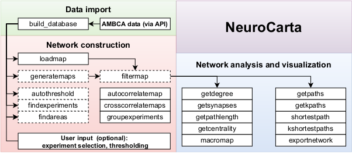

Neurocarta is a MATLAB toolbox for the construction and analysis of neural networks based on neural projections data from the Allen Brain Atlas.

## About
This toolbox can be used to compile neural projections data from the Allen Mouse Connectivity Atlas (AMBCA), and construct and analyze neural networks based on this dataset. The AMBCA consists of many neuroimaging experiments in mice where the monosynaptic projections are captured using a fluorescent protein expressing viral tracer. These projections are quantified using a [neuroinformatics pipeline](https://www.ncbi.nlm.nih.gov/pubmed/25536338) and published on the [AMBCA website](https://connectivity.brain-map.org).

This toolbox enables the user to download the dataset, import it into MATLAB, normalize the data and construct neural networks from projections data. The resulting network represents the bilateral anatomical network of the mouse brain, with connections representing axonal densities from one brain area to another. From this network a number of properties can be computed: degree of separation, shortest path from one area to another, overall degree of connectivity of the network, etc. The toolbox also includes functions for visualization of single experiments, i.e. an overview of projections originating in a particular brain area, targeting other areas throughout the brain. Cross-hemispheric connections are shown as well.

## Installation
The toolbox can be installed by downloading or cloning this repository and running build_database.m, which will download all of the necessary files. This will take some time but ensures that the dataset is up to date, since new experiments might be added at any point in time. A pre-installed version of the toolbox will be available in the future.

## Documentation
The full documentation can be found here: [Documentation](Documentation/Documentation.md)

## Data
The data comes from the [Allen Brain Atlas](https://brain-map.org).

Related publications:
* [A mesoscale connectome of the mouse brain](https://www.nature.com/articles/nature13186)
* [Neuroinformatics of the Allen Mouse Brain Connectivity Atlas](https://www.ncbi.nlm.nih.gov/pubmed/25536338)

An academic paper detailing the mechanisms of the toolbox is currently in preparation.